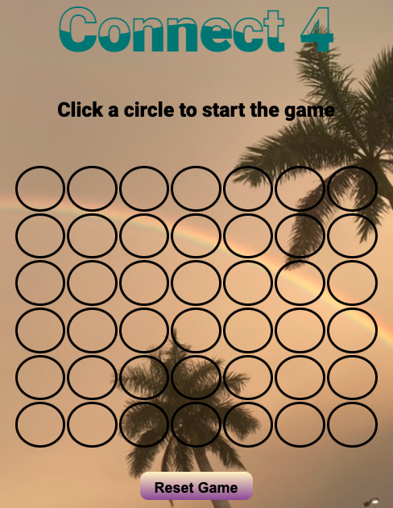

## Connect 4

The objective of the game is to get **_four_** consecutive matching tokens. Two players will alternate turns until there is a winner or the board is full of tokens rendering a tie. To initiate game play click on the column of your choice. 
 
 
# [Play Connect 4](https://rad-shortbread-da9ba9.netlify.app)

## Technologies used

* CSS 
* JavaScript
* HTML
* git

## Credits

* Connect 4 uses island favicon created on: [faviconer](http://www.faviconer.com/).

* Connect 4 uses Roboto Black 900 font found at: [Google Fonts](https://fonts.google.com).

## Ice Box
* Dark Mode
* Sound for token placement on game board
* Falling token Animations

## [Project Planning Material](https://docs.google.com/document/d/1ANtO8u0AT7pqnwB6jHk41RL9Snvpq0kKAApw5W6iz6I/edit)

